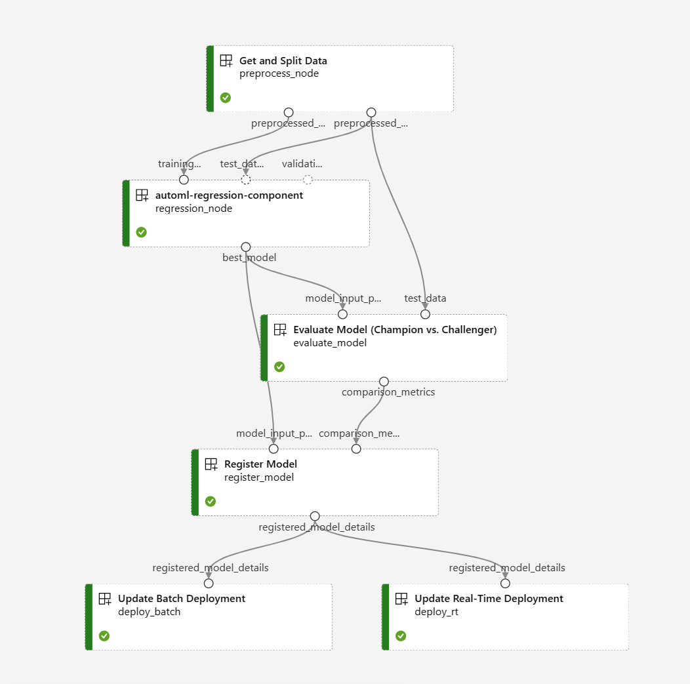

# Azure Machine Learning - AutoML Example (v2 SDK)

#### Example notebook showcasing how to kick off an AutoML training job using the v2 SDK.

In this sample, we retrieve data from a publicly available source, register training & validation datasets to our AML workspace, then execute an AutoML training job. Upon completion of the AutoML run, we will retrieve the best performing model and run it locally using a `ManagedOnlineEndpoint`. Here, we can run our new model from a Docker container and can easily update our deployment to target cloud compute resources if we aim to make the model available to other users/applications/processes.

<b> Update (Jan. 16th, 2024):</b>
We have modified this sample so that all of the steps listed above are executed as part of an Azure Machine Learning pipeline. In this pipeline we perform the following steps:
- Load training/evaluation data from an ADLS Gen2-backed Delta Table
- Train a regression model using Azure Machine Learning's AutoML capabilities
- Perform a champion vs. challenger evaluation test to determine if the newly trained model performs better than the existing model on a common dataset (note: in this step, if the previous model performs better the pipeline cancels further execution)
- Register the newly trained model
- Update a managed batch endpoint with our newly trained/registered model
- Update a managed real-time endpoint with our newly trained/registered model 

<i>Note:</i> This sample was adapted from the following examples:
- https://github.com/Azure/azureml-examples/tree/main/sdk/python/jobs/automl-standalone-jobs/automl-regression-task-hardware-performance
- https://learn.microsoft.com/en-us/azure/machine-learning/how-to-deploy-online-endpoints?view=azureml-api-2&tabs=python
